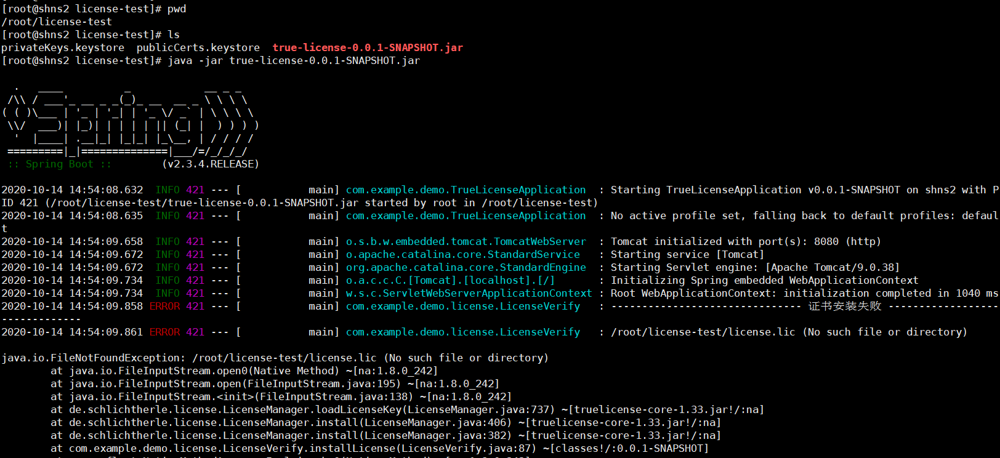
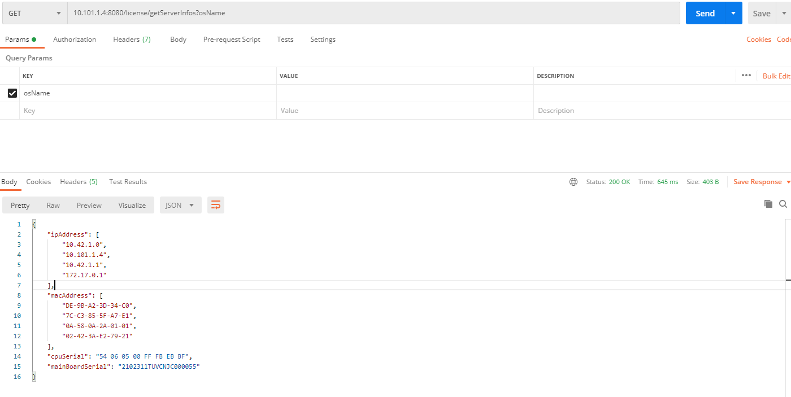
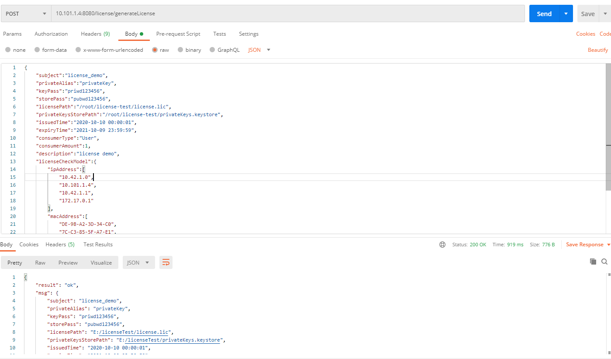
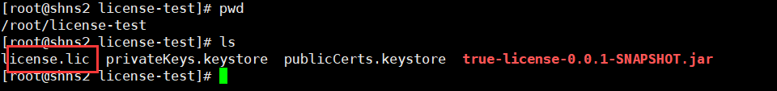
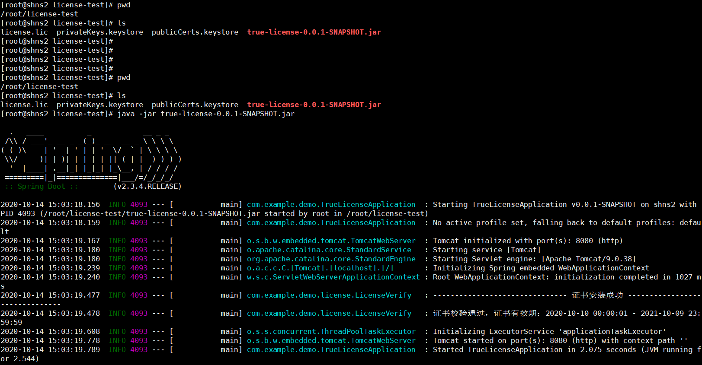

<!-- TOC -->

- [前言](#%E5%89%8D%E8%A8%80)
- [SpringBoot 整合 TrueLicense](#springboot-%E6%95%B4%E5%90%88-truelicense)
    - [添加依赖](#%E6%B7%BB%E5%8A%A0%E4%BE%9D%E8%B5%96)
    - [License 服务器校验参数](#license-%E6%9C%8D%E5%8A%A1%E5%99%A8%E6%A0%A1%E9%AA%8C%E5%8F%82%E6%95%B0)
    - [License 创建参数](#license-%E5%88%9B%E5%BB%BA%E5%8F%82%E6%95%B0)
    - [获取服务器硬件信息抽象类](#%E8%8E%B7%E5%8F%96%E6%9C%8D%E5%8A%A1%E5%99%A8%E7%A1%AC%E4%BB%B6%E4%BF%A1%E6%81%AF%E6%8A%BD%E8%B1%A1%E7%B1%BB)
    - [获取客户 Linux 服务器的基本信息](#%E8%8E%B7%E5%8F%96%E5%AE%A2%E6%88%B7-linux-%E6%9C%8D%E5%8A%A1%E5%99%A8%E7%9A%84%E5%9F%BA%E6%9C%AC%E4%BF%A1%E6%81%AF)
    - [获取客户 Windows 服务器的基本信息](#%E8%8E%B7%E5%8F%96%E5%AE%A2%E6%88%B7-windows-%E6%9C%8D%E5%8A%A1%E5%99%A8%E7%9A%84%E5%9F%BA%E6%9C%AC%E4%BF%A1%E6%81%AF)
    - [自定义 License 管理，创建、安装、校验等](#%E8%87%AA%E5%AE%9A%E4%B9%89-license-%E7%AE%A1%E7%90%86%E5%88%9B%E5%BB%BA%E5%AE%89%E8%A3%85%E6%A0%A1%E9%AA%8C%E7%AD%89)
    - [自定义密钥存储](#%E8%87%AA%E5%AE%9A%E4%B9%89%E5%AF%86%E9%92%A5%E5%AD%98%E5%82%A8)
    - [License 创建](#license-%E5%88%9B%E5%BB%BA)
    - [证书配置](#%E8%AF%81%E4%B9%A6%E9%85%8D%E7%BD%AE)
    - [License 校验、安装、卸载](#license-%E6%A0%A1%E9%AA%8C%E5%AE%89%E8%A3%85%E5%8D%B8%E8%BD%BD)
    - [License 生成证书 Service](#license-%E7%94%9F%E6%88%90%E8%AF%81%E4%B9%A6-service)
        - [LicenseCreatorService](#licensecreatorservice)
        - [LicenseCreatorServiceImpl](#licensecreatorserviceimpl)
    - [License 生成证书 Controller](#license-%E7%94%9F%E6%88%90%E8%AF%81%E4%B9%A6-controller)
- [TrueLicense 创建、安装证书](#truelicense-%E5%88%9B%E5%BB%BA%E5%AE%89%E8%A3%85%E8%AF%81%E4%B9%A6)
    - [使用 keytool 生成公私钥证书库](#%E4%BD%BF%E7%94%A8-keytool-%E7%94%9F%E6%88%90%E5%85%AC%E7%A7%81%E9%92%A5%E8%AF%81%E4%B9%A6%E5%BA%93)
    - [项目配置](#%E9%A1%B9%E7%9B%AE%E9%85%8D%E7%BD%AE)
    - [为客户生成 license 文件](#%E4%B8%BA%E5%AE%A2%E6%88%B7%E7%94%9F%E6%88%90-license-%E6%96%87%E4%BB%B6)
- [证书有效性校验](#%E8%AF%81%E4%B9%A6%E6%9C%89%E6%95%88%E6%80%A7%E6%A0%A1%E9%AA%8C)

<!-- /TOC -->

# 前言

License，即版权许可证，一般用于收费软件给付费用户提供的访问许可证明。当应用部署在客户的内网环境，因为这种情况开发者无法控制客户的网络环境，也不能保证应用所在服务器可以访问外网，因此通常的做法是使用服务器许可文件，在应用启动的时候加载证书，并验证证书的有效性，如果无效则限制应用启动。

本文只考虑代码层面的许可限制，暂不考虑逆向破解问题。

## 项目结构

~~~
com.yunjin.license     
├── yunjin-license                            // pom父工程
│       └── yunjin-license-core               // 核心模块 
│       └── yunjin-license-verify             // 证书验证模块 
│       └── yunjin-license-generate           // 证书生成模块 
├──pom.xml    // 版本控制
~~~

为保证安全，原则上交付的jar包中不应该存在证书生成模块，防止客户自行签发证书。证书生成服务应妥善管理，严格控制证书管理和签发。

所交付的应用中，只需要集成证书验证模块即可。

# SpringBoot 整合 License组件

## 添加依赖

```
    <dependency>
        <groupId>com.yunjin</groupId>
        <artifactId>yunjin-license</artifactId>
        <version>最新版本</version>
    </dependency>
```

TrueLicense 的 ```de.schlichtherle.license.LicenseManager``` 类自带的 verify
方法只校验了我们后面颁发的许可文件的生效和过期时间，然而在实际项目中我们可能需要额外校验应用部署的服务器的 IP 地址、MAC
地址、CPU 序列号、主板序列号等信息，因此我们复写了框架的部分方法以实现校验自定义参数的目的。

# 使用步骤

## License 服务器校验参数

# 证书创建原理

## 使用 keytool 生成公私钥证书库

例如：私钥库密码为 priwd123456，公钥库密码为 pubwd123456，生成步骤如下：

```
# 1. 生成私钥库
# validity：私钥的有效期（天）
# alias：私钥别称
# keystore：私钥库文件名称（生成在当前目录）
# storepass：私钥库密码（获取 keystore 信息所需的密码，密钥库口令）
# keypass：别名条目的密码(密钥口令)
keytool -genkeypair -keysize 1024 -validity 3650 -alias "privateKey" -keystore "privateKeys.keystore" -storepass "pubwd123456" -keypass "priwd123456" -dname "CN=localhost, OU=localhost, O=localhost, L=SH, ST=SH, C=CN"

# 2. 把私钥库内的公钥导出到一个文件当中
# alias：私钥别称
# keystore：私钥库的名称（在当前目录查找）
# storepass：私钥库的密码
# file：证书名称
keytool -exportcert -alias "privateKey" -keystore "privateKeys.keystore" -storepass "pubwd123456" -file "certfile.cer"

# 3.再把这个证书文件导入到公钥库，certfile.cer 没用了可以删掉了
# alias：公钥名称
# file：证书名称
# keystore：公钥文件名称
# storepass：公钥库密码
keytool -import -alias "publicCert" -file "certfile.cer" -keystore "publicCerts.keystore" -storepass "pubwd123456"
```

## 项目配置

```
server:
  port: 8080
# License 相关配置
license:
  # 主题
  subject: license_demo
  # 公钥别称
  publicAlias: publicCert
  # 访问公钥的密码
  storePass: pubwd123456
  # license 位置
  licensePath: E:/licenseTest/license.lic
  # licensePath: /root/license-test/license.lic
  # 公钥位置
  publicKeysStorePath: E:/licenseTest/publicCerts.keystore
  # publicKeysStorePath: /root/license-test/publicCerts.keystore
```

## 为客户生成 license 文件

1. 将项目打包，然后部署到客户服务器（这里以一台 linux 服务器为例演示）,项目配置文件如下：

```
server:
  port: 8080
# License 相关配置
license:
  # 主题
  subject: license_demo
  # 公钥别称
  publicAlias: publicCert
  # 访问公钥的密码
  storePass: pubwd123456
  # license 位置
  # licensePath: E:/licenseTest/license.lic
  licensePath: /root/license-test/license.lic
  # 公钥位置
  # publicKeysStorePath: E:/licenseTest/publicCerts.keystore
  publicKeysStorePath: /root/license-test/publicCerts.keystore
```



2. 可以看到第一次启动找不到证书文件，证书安装失败
3. 通过调用前面所写的接口 ```/license/getServerInfos```，获取服务器硬件信息

```
{
    "ipAddress": [
        "10.42.1.0",
        "10.101.1.4",
        "10.42.1.1",
        "172.17.0.1"
    ],
    "macAddress": [
        "DE-9B-A2-3D-34-C0",
        "7C-C3-85-5F-A7-E1",
        "0A-58-0A-2A-01-01",
        "02-42-3A-E2-79-21"
    ],
    "cpuSerial": "54 06 05 00 FF FB EB BF",
    "mainBoardSerial": "2102311TUVCNJC000055"
}
```



3. 调用前面所写的接口 ```/license/generateLicense```，生成 license 文件

```
{
    "subject":"license_demo",
    "privateAlias":"privateKey",
    "keyPass":"priwd123456",
    "storePass":"pubwd123456",
    "licensePath":"/root/license-test/license.lic",
    "privateKeysStorePath":"/root/license-test/privateKeys.keystore",
    "issuedTime":"2020-10-10 00:00:01",
    "expiryTime":"2021-10-09 23:59:59",
    "consumerType":"User",
    "consumerAmount":1,
    "description":"license demo",
    "licenseCheckModel":{
        "ipAddress":[
            "10.42.1.0",
            "10.101.1.4",
            "10.42.1.1",
            "172.17.0.1"
        ],
        "macAddress":[
            "DE-9B-A2-3D-34-C0",
            "7C-C3-85-5F-A7-E1",
            "0A-58-0A-2A-01-01",
            "02-42-3A-E2-79-21"
        ],
        "cpuSerial":"54 06 05 00 FF FB EB BF",
        "mainBoardSerial":"2102311TUVCNJC000055"
    }
}
```



请求成功后会在设置的 licensePath 目录下生成一个 license.lic 文件



4. 重新启动服务，证书安装成功



# 证书有效性校验

为了方便调试，直接在本地运行了，验证证书有效性代码如下（实际生产中，需要在项目代码多处关键位置埋点，校验证书的有效性）：

```
package com.example.demo;

import license.com.yunjin.LicenseVerify;
import org.junit.jupiter.api.Test;
import org.springframework.beans.factory.annotation.Autowired;
import org.springframework.boot.test.context.SpringBootTest;

@SpringBootTest
class TrueLicenseApplicationTests {
    private LicenseVerify licenseVerify;

    @Autowired
    public void setLicenseVerify(LicenseVerify licenseVerify) {
        this.licenseVerify = licenseVerify;
    }

    @Test
    void contextLoads() {
        System.out.println("licese是否有效：" + licenseVerify.verify());
    }
}
```

1. 在创建证书的情况下，运行证书校验单元测试，打印证书无效的信息


2. 直接将前文在服务器上生成的证书下载到本地，启动项目，打印证书无效的信息（安装证书前会校验，IP地址、MAC 地址、CPU
   序列号等前文设置的校验参数，防止证书复制翻版）


3. 重复上述证书创建安装过程后，再次运行证书校验单元测试，证书有效，测试通过


# [参考源码](https://github.com/JCXTB/TrueLicense)

https://github.com/JCXTB/TrueLicense
