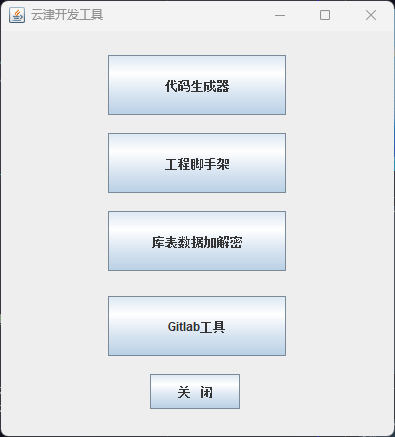
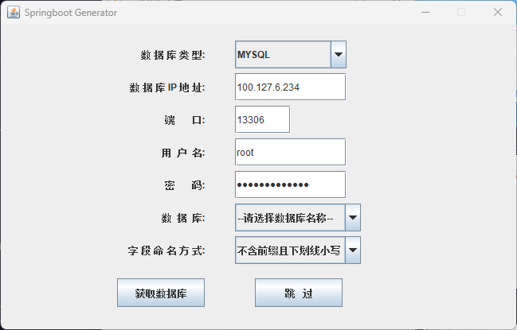
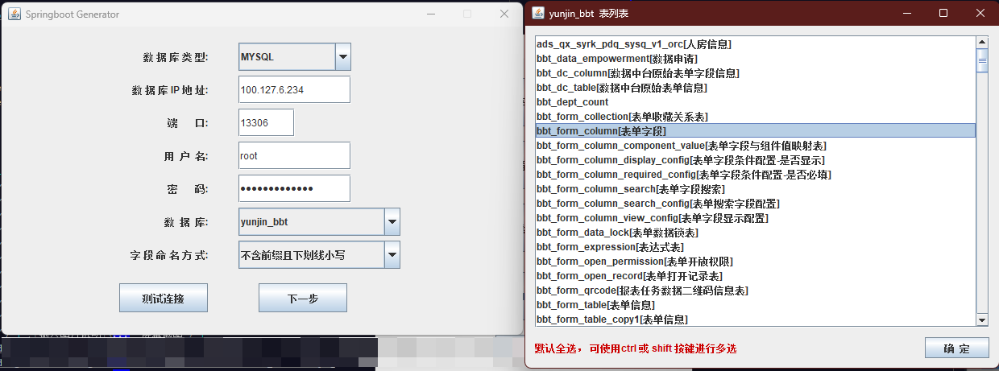
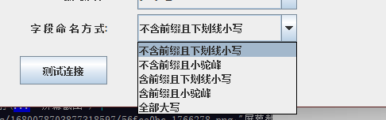
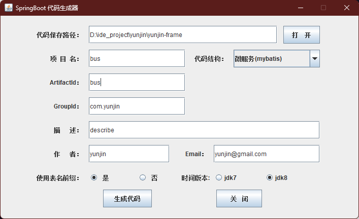

<h1 align="center" style="margin: 30px 0 30px; font-weight: bold;">Yunjin-Tools</h1>
<h4 align="center">Java GUI桌面工具</h4>

## 模块简介

该模块集成开发常见GUI工具，给开发者提供代码生成，工程快速初始化的能力，协助开发者快速开发。减少开发前期工作量。

* 技术栈：Swing、Hutool、JDBC、gitlab4j、Freemarker、mysql

## 模块结构

~~~
yunjin-tools     
├── codege              // 代码生成工具文件
├── encrypt             // 加解密工具文件
├── gitlab              // gitlab工具文件
├── projectge           // 工程脚手架工具文件
├── ui                  // 工具集成页面
├── ToolsApplication            // 工具入口
├── resources
   └── codege                   // 代码生成器资源文件
        └── templates           // 模板文件
        └── typeConverter.xml   // 类型映射配置文件 
   └── projectge                // 工程脚手架资源文件     
├──pom.xml                      // 公共依赖
~~~

## 使用教程

### 代码生成器使用教程

代码生成器可生成mybatis/mongodb/elasticsearch的代码,无论生成哪种代码，都需要在mysql数据库中创建表，并对字段进行设计。

1. maven引入

   ```xml
   <dependency>
    <groupId>com.yunjin</groupId>
    <artifactId>yunjin-tools</artifactId>
    <version>最新版本</version>
   </dependency>
   ```

2. 方法使用

```java
public class TestClass {

    public static void main(String[] args) {
        ToolsApplication.start();
    }
}
```

3. 表设计并运行工具

   在mysql中设计表及字段信息，供工具读取。随后运行main方法，如图所示，点击代码生成器：
   

4. 填写数据库信息  
   

* 数据库类型：目前仅支持Mysql
* 数据库基础信息: 输入用户名、密码、ip、端口，点击获取数据库即可列出数据库列表
  
* 字段命名方式：选择与字段设计匹配的命名方式</br>
  1.不含前缀且下划线小写：如user_name、table_id</br>
  2.不含前缀且小驼峰：如userName、tableId</br>
  3.含前缀且小驼峰： 如f_userName、f_tableId</br>
  4.含前缀且下划线小写： 如f_user_name、f_table_id</br>
  5.全部大写： 如USER_NAME、TABLE_ID</br>
  

5. 填写代码生成信息  
   

### 工程脚手架使用教程


